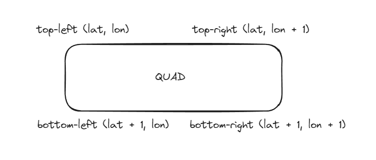

# Opengl Expirement
# Sphere Generation

In order to create a sphere a structure known as the sphere constructor where you input the radius longitude, and position is given.
- for each point in the sphere, at a specific longitude and latitude, we get two angles phi and theta, which will help us construct the sphere.
- to change the location of the sphere, a transform matrix is used
## Indices
In 3D rendering with indexed primitives, the **primitive index type** used for a sphere depends on the range of vertices you’re indexing:
1. **`u16` (16-bit unsigned integer)**: Use this type if you have fewer than 65,536 vertices. It’s common for lower-resolution spheres or less detailed meshes, as it saves memory and can be faster for the GPU to process.
2. **`u32` (32-bit unsigned integer)**: Use this type if you have 65,536 vertices or more. Higher-resolution spheres or very detailed meshes generally require `u32` indices since `u16` wouldn’t cover the total vertex count.

For spheres, the top and bottom vertices act as "singularities":
- **Top Pole**: The northernmost vertex is shared by all segments of the first ring.
- **Bottom Pole**: The southernmost vertex is shared by all segments of the last ring.
The indexing system works because each `quad` has four vertices that logically represent a grid cell on the sphere's surface. Dividing this grid cell into two triangles allows OpenGL (or the rendering API) to rasterize them correctly, creating a smooth spherical appearance when enough latitude and longitude divisions are used.




# Physics Engine for Space Bodies
(Check previous commits an example was shown)
This project is a **Rust**-based physics engine designed to simulate the gravitational interactions between celestial bodies. It allows users to explore basic physics principles, especially orbital mechanics, through an interactive sandbox environment.

## Future Features
- **Planet Generation:** Create and simulate planetary bodies interacting through gravitational forces.
- **Gravitational Physics:** Implements Newton's law of universal gravitation to calculate forces between space bodies.
- **Orbit Simulation:** Uses the **Euler-Cromer** method for stable orbit calculations.
- **Customizable Parameters:** Adjust variables like mass, velocity, and position to observe different outcomes.
- **Visual Animation:** Real-time animation of planetary orbits based on user-defined parameters.

# TODO:

### 1. Introduction to Gravitational Force

The simulation is based on Newton's law of gravitational force:
$$ F = \frac{G \cdot m_1 \cdot m_2}{r^2} $$

Where:
- $(F)$ is the gravitational force between two bodies.
- $(G)$ is the universal gravitational constant.
- $(m_1)$ and $(m_2)$ are the masses of the two bodies.
- $(r)$ is the distance between the bodies.

This formula allows the engine to simulate interactions like planetary orbits, satellite paths, and more complex behaviors such as binary star systems.

### 2. Euler-Cromer Method for Simulating Orbits

This method updates both position and velocity over time and ensures more accurate and stable orbit simulations compared to basic Euler methods. It works by recalculating the planet's position after each step, based on the force of gravity exerted by the central star or other planets.

## 3. Gravitational Force Calculation

A dedicated function calculates the gravitational force between any two objects by:
- Determining the distance vector.
- Calculating the direction and magnitude of the force.
- Returning the final force applied to the object.

## 4. Orbit Animation

As the simulation runs, the positions and velocities of the bodies are updated frame-by-frame using the Euler-Cromer method, allowing users to visualize the orbital paths. 

## 5. Changing Mass and Orbital Parameters

By increasing or decreasing the mass of the star or planet, users can observe how the orbital radius expands or contracts accordingly. The tool allows experimentation by modifying mass, position, and momentum to see how each affects the system.

## 6. Modifiable Parameters

The following parameters are customizable:
- **Star Mass**: Controls the gravitational pull exerted on planets.
- **Planet Position and Momentum**: Adjust initial conditions to generate different orbital behaviors.
- **Time Step**: Fine-tune the precision of the simulation for more accurate results.

# How to Use

1. Clone the repository:
   ```bash
   git clone https://github.com/MadebyDaris/ogl.git
   cd ogl
   ```

2. Build the project:
   ```bash
   cargo build
   ```

3. Run the simulation:
   ```bash
   cargo run
   ```

4. Modify the parameters in the configuration file or directly in the code to experiment with different planetary systems.

## Dependencies

- **glium**: For rendering the graphical output.
- **image**: For handling textures and visualization.

Install all dependencies using:

```bash
cargo build
```

---

Feel free to modify and extend the project to suit your needs